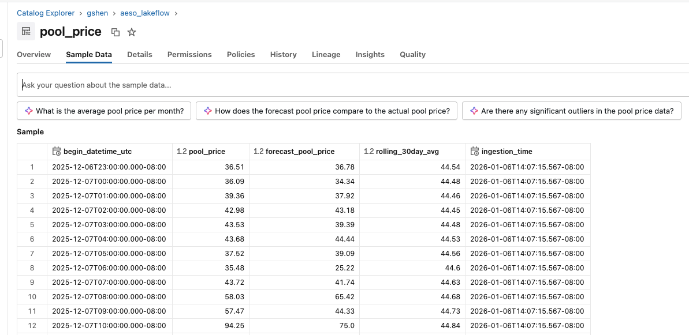
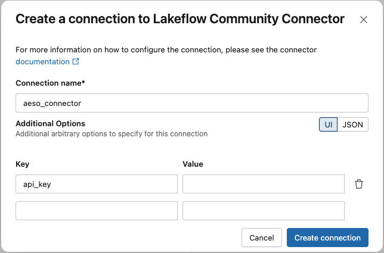

# AESO Connector for Databricks

Ingest Alberta electricity market data from the [AESO API](https://developer-apim.aeso.ca/) into Databricks Unity Catalog with automatic incremental updates.

## Supported Data

**Currently Available:**
- **`pool_price`** - Hourly electricity pool prices, forecasts, and 30-day rolling averages

**Extensible:** This connector can be extended to support additional AESO data objects (e.g., load, supply, interchange). Contributions welcome!

## What You Get

- ⚡ **Hourly market data** - Actual prices, forecasts, and 30-day rolling averages
- 🔄 **Automatic updates** - Captures late-arriving settlement adjustments and forecast revisions
- 🚀 **Sub-minute latency** - Supports continuous mode for near-real-time ingestion
- 📊 **Historical backfill** - Load data from any start date with automatic merges
- 🔁 **Automatic recovery** - Configurable lookback window handles pipeline downtime



## Quick Start

### 1. Get Your API Key

Sign up at [AESO API Portal](https://developer-apim.aeso.ca/) to get your API key.

### 2. Create Connection in Databricks

Create a Unity Catalog connection with your AESO API key:




### 3. Configure Your Pipeline

**Minimal setup (uses defaults):**

```python
pipeline_spec = {
    "connection_name": "aeso_connector",
    "objects": [
        {
            "table": {
                "source_table": "pool_price",
                "destination_table": "pool_price",
            }
        }
    ],
}
```

**With all table configuration options:**

```python
pipeline_spec = {
    "connection_name": "aeso_connector",
    "objects": [
        {
            "table": {
                "source_table": "pool_price",
                "destination_catalog": "gshen",
                "destination_schema": "aeso_lakeflow",
                "destination_table": "pool_price",
                "table_configuration": {
                    "scd_type": "SCD_TYPE_1",
                    "start_date": "2024-01-01",
                    "lookback_hours": "24",
                    "batch_size_days": "30",
                    "rate_limit_delay": "0.1"
                }
            }
        }
    ],
}
```

### 4. Schedule Your Pipeline

The connector supports both execution modes within Databricks Workflows:

**Triggered Mode** - Runs on a schedule (hourly, every 15 minutes, etc.) and performs incremental updates each time it executes. Best for standard production workloads.

```python
# Example: Hourly updates
schedule = {
    "quartz_cron_expression": "0 * * * ?",
    "timezone_id": "America/Edmonton"
}
```

**Continuous Mode** - Continuously polls the AESO API and updates your table in near real-time (sub-minute latency). Best for dashboards and real-time analytics.

```python
# Example: Continuous streaming
schedule = {
    "continuous": {
        "pause_status": "UNPAUSED"
    }
}
```

Both modes automatically handle incremental loading and late-arriving data through the configurable lookback window.


## Configuration Options

### Table Configuration

| Option | Default | Description |
|--------|---------|-------------|
| `scd_type` | SCD_TYPE_1 |  Supports SCD Type 1 and Type 2|
| `start_date` | 30 days ago | Historical start date for initial load (YYYY-MM-DD) |
| `lookback_hours` | 24 | Hours to look back on each sync. **Minimum: 24 hours**.
| `batch_size_days` | 30 | Days per API request (increase for larger extracts, keep under 365 days) |
| `rate_limit_delay` | 0.1 | Seconds between API calls (increase if rate limited) |

**Key insight:** `lookback_hours` serves two purposes:
1. **Backfill after downtime** - If your pipeline stops for hours/days, the lookback ensures you recapture data from that gap. To support a 7-day outage, set `lookback_hours` to outage duration + 24 hours (e.g., 192 hours for 7 days)
2. **Capture forecast updates** - AESO continuously updates `forecast_pool_price` as settlement hours approach

### Choosing Your Schedule

| Schedule | `lookback_hours` | Best For |
|----------|------------------|----------|
| **Continuous** | 24 | Near-Real-time use cases, sub-minute latency |
| Every 15 min | 24 | Low latency monitoring |
| **Hourly (recommended)** | **24** | **Standard production use** |
| Daily | 72 | Cost-optimized, non-time-sensitive |


Actual pool prices are also revised during final settlement. **A minimum 24-hour lookback is enforced** to safely capture settlement adjustments and late-arriving data.

## Output Schema

### `pool_price` Table

The connector outputs data from the AESO Pool Price Report with the following schema:

| Column | Type | Description |
|--------|------|-------------|
| `begin_datetime_utc` | timestamp | Hour start in UTC (Primary Key) |
| `pool_price` | double | Actual price $/MWh (null for future hours; finalized during settlement) |
| `forecast_pool_price` | double | Forecasted price $/MWh (updated frequently as hour approaches) |
| `rolling_30day_avg` | double | 30-day rolling average $/MWh |
| `ingestion_time` | timestamp | When this record was last updated (used for SCD sequencing) |

**Note:** The connector uses `ingestion_time` to determine which version of a record is latest during merges.

## How It Works

### Initial Load
Fetches from `start_date` (or last 30 days) to today, creating your baseline dataset.

### Incremental Updates
Each run fetches from `(last_watermark - lookback_hours)` to today, ensuring:
- **Pipeline downtime backfill** - If the pipeline stops for any period, the lookback recaptures missed data
- **New hourly records** are captured as hours complete
- **Updated forecast prices** are merged in (AESO updates forecasts frequently as hours approach)
- **Revised actual prices** are captured during final settlement (typically within 24-72 hours)

**Example (daily schedule, 24h lookback):**
- **Run 1 (Jan 15):** Fetch Jan 1 → Jan 15 (initial load)
- **Run 2 (Jan 16):** Fetch Jan 15 → Jan 16 (1 day overlap to catch updates)
- **Run 3 (Jan 17):** Fetch Jan 16 → Jan 17 (1 day overlap to catch updates)

## Common Scenarios

### Starting Fresh with Historical Data

```json
"table_configuration": {
  "scd_type": "SCD_TYPE_1",
  "start_date": "2023-01-01"
}
```

### High-Frequency Updates (continous refresh)

```json
"table_configuration": {
  "scd_type": "SCD_TYPE_1",
  "lookback_hours": "2"
}
```


### Recovery from Pipeline Downtime

If your pipeline stops for hours or days, update the `lookback_hours` setting to automatically backfill and merge:

```json
"table_configuration": {
  "scd_type": "SCD_TYPE_1",
  "lookback_hours": "72"
}
```

**How it works:**
- Pipeline stops at Jan 5, 10:00 AM
- Pipeline restarts at Jan 8, 2:00 PM
- Next run fetches from Jan 5 (watermark - 72h lookback) → today
- All missed data is automatically recaptured

**Recommendation:** Set `lookback_hours` ≥ your maximum expected downtime.

## Troubleshooting

| Issue | Solution |
|-------|----------|
| **401 Authentication Error** | Verify API key at [AESO API Portal](https://api.aeso.ca) |
| **Missing recent updates** | Increase `lookback_hours` to capture longer settlement windows |
| **Rate limiting (429)** | Increase `rate_limit_delay` or reduce schedule frequency |
| **High memory usage** | Reduce `batch_size_days` to fetch smaller batches |

## Important Notes

- **SCD Type 1 (recommended)** - Latest values overwrite previous records. Best for most use cases.
- **SCD Type 2** - Tracks historical changes using `ingestion_time`. Note: Will create duplicate records based on `lookback_hours` since data is refetched with each sync.
- **Forecast prices update frequently** - AESO revises `forecast_pool_price` as settlement hours approach.
- Prices can be **negative** during oversupply conditions (this is normal).
- AESO publishes **hourly**, so frequent schedules (e.g., every 15 min) will often find no new completed hours.
- Always use `begin_datetime_utc` as your time dimension (DST-safe).

## Resources

- **AESO Python API:** https://github.com/guanjieshen/aeso-python-api
- **AESO Website:** https://www.aeso.ca
- **API Portal:** https://developer-apim.aeso.ca/
- **Connector Code:** `sources/aeso/aeso.py`
- **Extend for other tables:** The connector architecture supports adding additional AESO data objects (load, supply, interchange, etc.). See `aeso.py` for implementation details.
