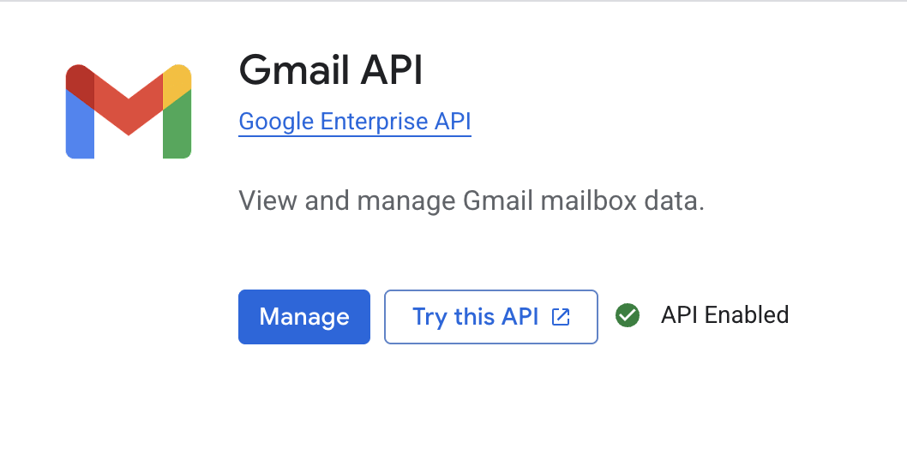
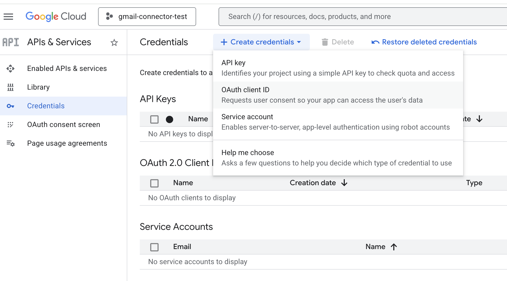
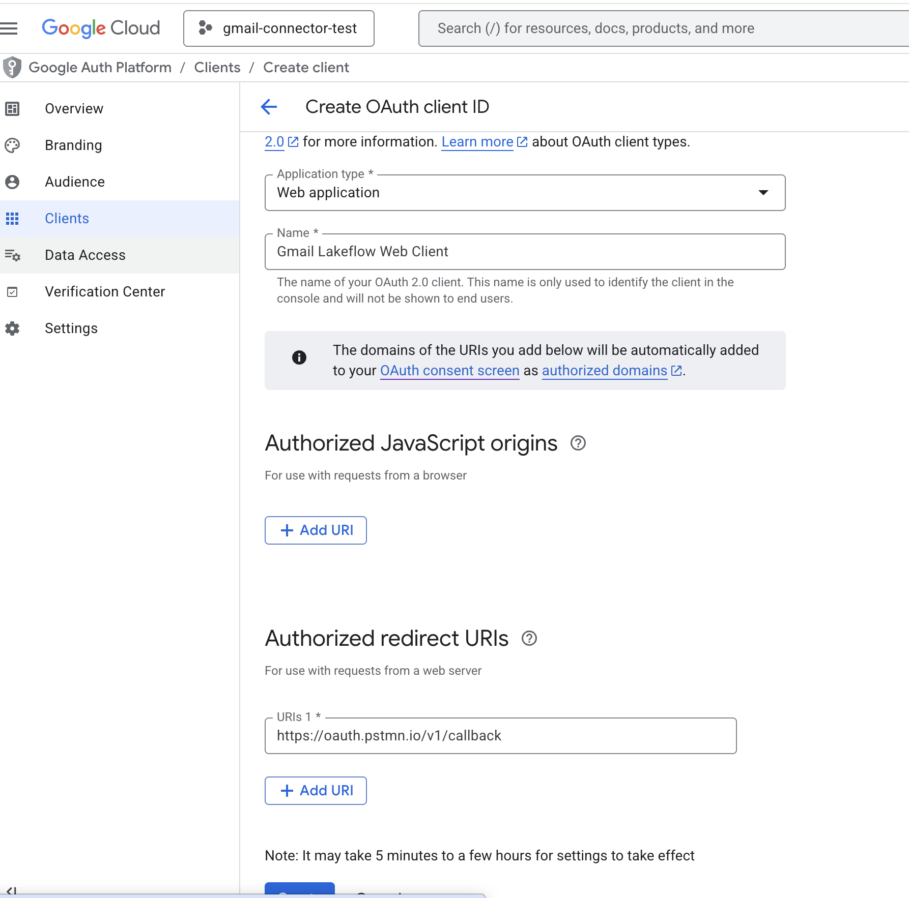
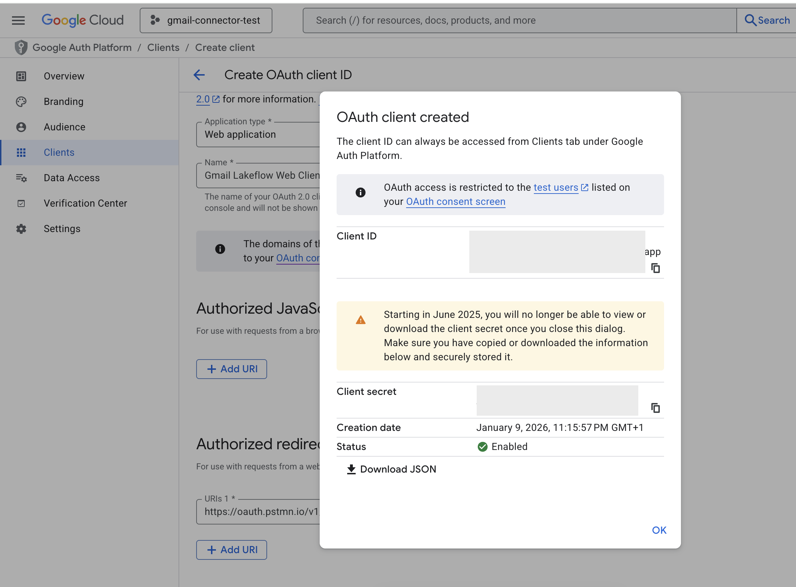
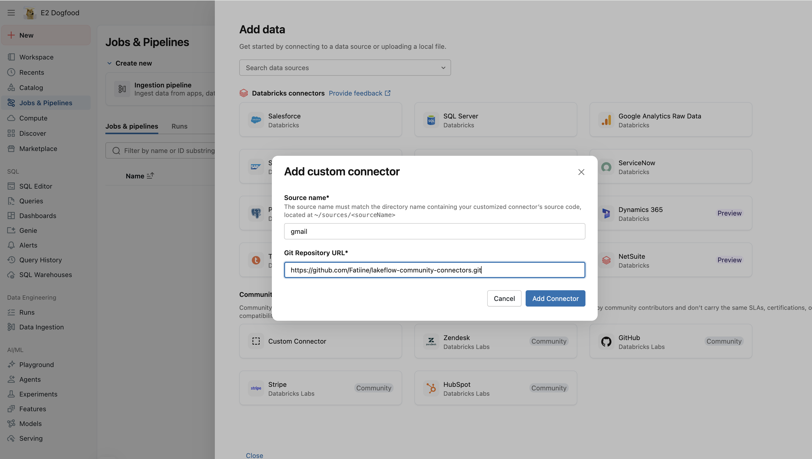
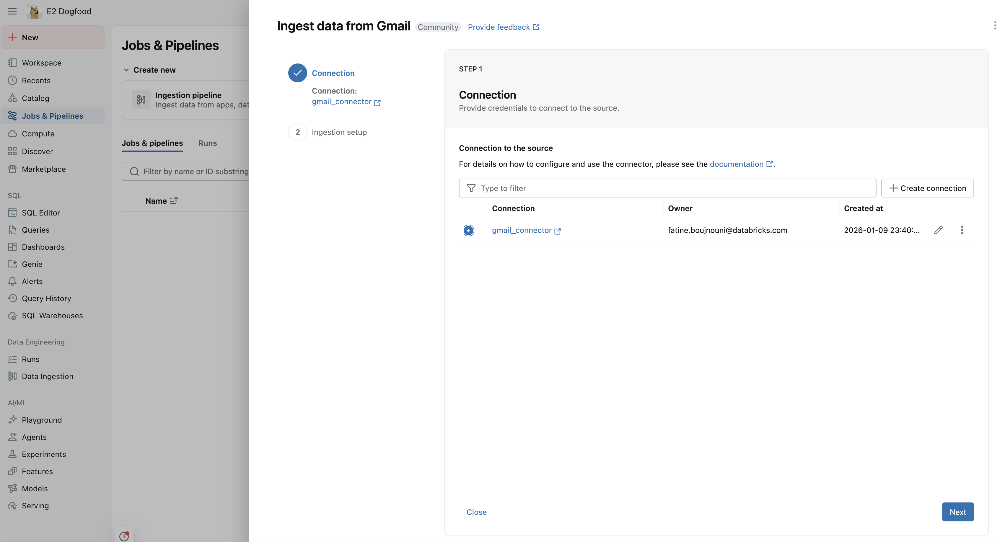
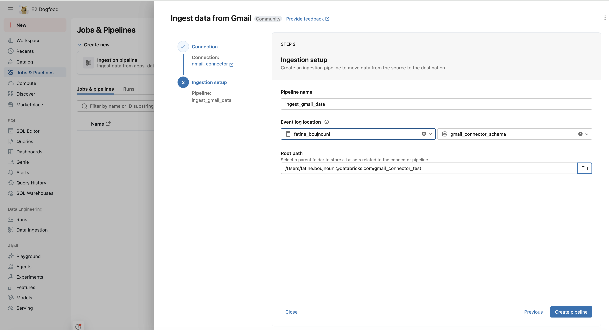

# Lakeflow Gmail Community Connector

This documentation describes how to configure and use the **Gmail** Lakeflow community connector to ingest email data from the Gmail API into Databricks.

## Prerequisites

- **Google Account**: A Google account with Gmail access (personal Gmail or Google Workspace).
- **Google Cloud Project**: A project in Google Cloud Console with the Gmail API enabled.
- **Google OAuth client** (Web application): a `client_id` + `client_secret` pair you'll register with Databricks at connection-creation time. Databricks runs the user-facing OAuth flow against this client; you never paste a refresh token into the connector yourself.
- **OAuth scope** (must be granted at consent time): `https://www.googleapis.com/auth/gmail.readonly`
- **Network access**: The cluster must be able to reach `https://gmail.googleapis.com`.
- **Lakeflow / Databricks environment**: A workspace where you can register a Lakeflow community connector and run ingestion pipelines.

## Authentication model

This connector is built for the Unity Catalog **COMMUNITY** connection type with one of the U2M OAuth flows:

| Flow | When to pick it |
|---|---|
| `u2m` | One human authorizes once at connection creation; every pipeline using the connection sees that human's mail. Good for personal or team-shared mailboxes. |
| `u2m_per_user` | Each end user who queries the connection authorizes separately. Databricks resolves the right token per query at runtime. Good for apps where each user sees their own mail. |

Databricks owns the OAuth dance — authorization-code + PKCE exchange, refresh, per-user token mapping. The connector receives only a runtime `access_token` and treats it as opaque. There is no longer a need to capture a refresh token via Postman or curl.

If a token expires or is revoked mid-query, Gmail returns 401; re-run the connection setup to re-consent.

## Setup

### Step 1 — Create a Google Cloud project + enable the Gmail API

1. Go to [Google Cloud Console](https://console.cloud.google.com/) → **Select a project** → **New Project** (e.g. `Gmail Lakeflow Connector`).
2. **APIs & Services → Library**. Enable the **Gmail API**.



### Step 2 — Configure the OAuth consent screen

1. **APIs & Services → OAuth consent screen** → **Get started**.
2. Fill in **App information** (app name, support email) and **Developer contact information**.
3. Pick **External** (personal Gmail) or **Internal** (Workspace org).
4. **Audience**: if External, add test users (your own Gmail address while the app is in test mode).
5. **Data Access → Add or Remove Scopes**. Check `https://www.googleapis.com/auth/gmail.readonly`.
6. Save and continue.

### Step 3 — Create an OAuth 2.0 Web Application client

1. **APIs & Services → Credentials → Create Credentials → OAuth client ID**.
2. **Application type**: **Web application**.
3. Name it (e.g. `Gmail Lakeflow Web Client`).
4. **Authorized redirect URIs**: add the redirect URI(s) for the way(s) you'll create the connection. Add both if you'll use both.
   - **Databricks UI flow** (creating the connection from the **Add Data** page): add your workspace's redirect URL, substituting your own workspace host:
     ```
     https://<your-workspace-url>/login/oauth/http.html
     ```
     This must match exactly (scheme, host, path). If it's missing, the Google consent popup fails with `Error 400: redirect_uri_mismatch`.
   - **`community-connector` CLI flow**: add the loopback host the CLI listens on:
     ```
     http://localhost
     ```
     The CLI picks a free port at run time and registers `http://127.0.0.1:<port>/callback`. Google requires the host to be listed; the port is not part of the matching rule, so no workspace URL is needed for the CLI.
5. **Create**, then copy and save:
   - **Client ID** (e.g. `123456789-abc.apps.googleusercontent.com`)
   - **Client Secret** (e.g. `GOCSPX-xxxx...`)





### Step 4 — Create the Unity Catalog COMMUNITY connection

The connection can be created either through the Databricks UI or the
`community-connector` CLI. Both run the same u2m authorization-code flow
against Google — your browser opens, you sign in and grant consent, and
Databricks stores the resulting grant. The connector spec ships with the
OAuth flow definition baked in — `flow`, `scopes`, and Google's
`authorization_url` / `token_url` (see the `connection.oauth` block in
`connector_spec.yaml`) — so you only ever supply the OAuth app identity
(`client_id` + `client_secret`).

#### Option A — Databricks UI

A Unity Catalog connection for this connector can be created in two ways via the UI:

1. Follow the **Lakeflow Community Connector** UI flow from the **Add Data** page.
2. Select any existing Lakeflow Community Connector connection for this source or create a new one.
3. Supply the OAuth app identity (`client_id` + `client_secret`) and complete the in-browser Google consent when prompted; the `gmail.readonly` scope and Google's authorization / token URLs come from the connector spec.

> **Before using the UI flow**, make sure your OAuth client lists `https://<your-workspace-url>/login/oauth/http.html` under **Authorized redirect URIs** (Step 3). The UI flow redirects back to your workspace, not to a loopback, so without it Google rejects the consent popup with `redirect_uri_mismatch`.

The connection can also be created using the standard Unity Catalog API.

#### Option B — `community-connector` CLI

Run the `community-connector` CLI. The `--auth-type u2m` flag triggers an in-process loopback authorization-code + PKCE flow against Google; your browser opens, you sign in and grant consent, and the CLI captures the authorization code and registers it with the Databricks connection. You only supply the OAuth app identity (`client_id` + `client_secret`):

```bash
community-connector create-connection \
  --name gmail_connector \
  --source-name gmail \
  --auth-type u2m \
  --options '{
    "client_id": "<YOUR_CLIENT_ID>",
    "client_secret": "<YOUR_CLIENT_SECRET>"
  }'
```

For per-user authorization (one Databricks connection serving many end users, each consenting independently):

```bash
community-connector create-connection \
  --name gmail_connector_per_user \
  --source-name gmail \
  --auth-type u2m_per_user \
  --options '{
    "client_id": "<YOUR_CLIENT_ID>",
    "client_secret": "<YOUR_CLIENT_SECRET>"
  }'
```

What ends up in the connection vs the connector:

| Layer | Keys | Source |
|---|---|---|
| Connection (UC) | `client_id`, `client_secret` | you |
| Connection (UC) | `flow`, `scopes`, `authorization_url`, `token_url` | spec `connection.oauth` block |
| Connection (UC) | `community_oauth_flow` | derived from the spec's `oauth.flow` (`u2m` / `u2m_per_user`) |
| Connection (UC) | `authorization_code`, `pkce_verifier`, `oauth_redirect_uri` | CLI's loopback flow |
| Connector (runtime) | `access_token` | UC mints + refreshes from the stored grant |
| Connector (runtime) | `user_id` (optional) | you, via pipeline spec; defaults to `me` |

You never set `access_token` manually — UC handles it.

## Supported Objects

The Gmail connector provides **100% API coverage** with the following tables:

### Core Email Data
- `messages` - Email messages with full content
- `threads` - Email conversation threads
- `labels` - Gmail labels (system and user)
- `drafts` - Draft messages

### Account Information
- `profile` - User profile and mailbox statistics

### Settings & Configuration
- `settings` - Combined account settings (IMAP, POP, vacation, language, auto-forwarding)
- `filters` - Email filter rules
- `forwarding_addresses` - Configured forwarding addresses
- `send_as` - Send-as email aliases
- `delegates` - Delegated access users

### Object Summary, Primary Keys, and Ingestion Mode

| Table | Description | Ingestion Type | Primary Key | Cursor Field |
|-------|-------------|----------------|-------------|--------------|
| `messages` | Individual email messages with headers and body | `cdc` | `id` | `historyId` |
| `threads` | Email conversation threads containing messages | `cdc` | `id` | `historyId` |
| `labels` | Gmail labels including system and user labels | `snapshot` | `id` | n/a |
| `drafts` | Draft messages in the mailbox | `snapshot` | `id` | n/a |
| `profile` | User email, message/thread counts, historyId | `snapshot` | `emailAddress` | n/a |
| `settings` | IMAP, POP, vacation, language, forwarding settings | `snapshot` | `emailAddress` | n/a |
| `filters` | Email filter rules with criteria and actions | `snapshot` | `id` | n/a |
| `forwarding_addresses` | Email forwarding destinations | `snapshot` | `forwardingEmail` | n/a |
| `send_as` | Send-as aliases and signatures | `snapshot` | `sendAsEmail` | n/a |
| `delegates` | Users with delegated mailbox access | `snapshot` | `delegateEmail` | n/a |

### Incremental Sync Strategy

For `messages` and `threads` tables, the connector uses Gmail's **History API** for efficient incremental synchronization:

- **Initial sync**: Lists all items and captures the latest `historyId`
- **Subsequent syncs**: Uses `historyId` to fetch only added/modified items since the last sync
- **Automatic fallback**: If `historyId` expires (~30 days), automatically falls back to a full sync

### Delete Synchronization

The connector supports delete tracking for `messages` and `threads` via the `read_table_deletes` method:

- Uses Gmail History API with `historyTypes=messageDeleted`
- Returns minimal records (primary key + cursor) for deleted items
- Enables downstream systems to soft-delete or remove records

## Table Configurations

### Source & Destination

These are set directly under each `table` object in the pipeline spec:

| Option | Required | Description |
|---|---|---|
| `source_table` | Yes | Table name in the source system |
| `destination_catalog` | No | Target catalog (defaults to pipeline's default) |
| `destination_schema` | No | Target schema (defaults to pipeline's default) |
| `destination_table` | No | Target table name (defaults to `source_table`) |

### Common `table_configuration` options

These are set inside the `table_configuration` map alongside any source-specific options:

| Option | Required | Description |
|---|---|---|
| `scd_type` | No | `SCD_TYPE_1` (default) or `SCD_TYPE_2`. Only applicable to tables with CDC or SNAPSHOT ingestion mode; APPEND_ONLY tables do not support this option. |
| `primary_keys` | No | List of columns to override the connector's default primary keys |
| `sequence_by` | No | Column used to order records for SCD Type 2 change tracking |

### Source-specific `table_configuration` options

| Option | Type | Tables | Description |
|--------|------|--------|-------------|
| `q` | string | messages, threads | Gmail search query (same syntax as Gmail web UI) |
| `labelIds` | string | messages, threads | Filter by label ID (e.g., `INBOX`, `SENT`) |
| `maxResults` | integer | all | Maximum items per page (default: 100, max: 500) |
| `includeSpamTrash` | boolean | messages, threads | Include spam and trash (default: false) |
| `format` | string | messages, threads, drafts | Message format: `full` (default), `metadata`, `minimal` |

### Schema Highlights

**messages**:
- `id`, `threadId` - Unique identifiers
- `labelIds` - Array of label IDs applied to the message
- `snippet` - Short preview of message content
- `historyId` - Used for incremental sync cursor
- `internalDate` - Epoch milliseconds of message creation
- `payload` - Full parsed message structure including headers and body parts

**threads**:
- `id` - Thread identifier
- `snippet` - Preview of latest message
- `messages` - Array of messages in the thread

**labels**:
- `id`, `name` - Label identification
- `type` - `system` or `user`
- `messagesTotal`, `messagesUnread` - Message counts
- `color` - Label color settings

**drafts**:
- `id` - Draft identifier
- `message` - Full message content of the draft

**profile**:
- `emailAddress` - User's email address
- `messagesTotal`, `threadsTotal` - Mailbox counts
- `historyId` - Current history ID for sync

**settings**:
- `emailAddress` - User identifier
- `autoForwarding` - Auto-forwarding configuration
- `imap` - IMAP access settings
- `pop` - POP access settings
- `language` - Display language
- `vacation` - Vacation auto-reply settings

**filters**:
- `id` - Filter identifier
- `criteria` - Match criteria (from, to, subject, query, etc.)
- `action` - Actions (addLabelIds, removeLabelIds, forward)

**forwarding_addresses**:
- `forwardingEmail` - Forwarding destination email
- `verificationStatus` - Verification state

**send_as**:
- `sendAsEmail` - Send-as email address
- `displayName`, `signature` - Display settings
- `isPrimary`, `isDefault` - Status flags
- `verificationStatus` - Verification state

**delegates**:
- `delegateEmail` - Delegate's email address
- `verificationStatus` - Delegation status

## Data Type Mapping

| Gmail API Type | Spark SQL Type | Notes |
|----------------|----------------|-------|
| string | `StringType` | Standard text fields |
| string (int64) | `StringType` | `historyId`, `internalDate` stored as strings |
| integer | `LongType` | `sizeEstimate`, message counts |
| boolean | `BooleanType` | Flag fields |
| array[string] | `ArrayType(StringType)` | `labelIds` |
| array[object] | `ArrayType(StructType)` | `headers`, `parts`, `messages` |
| object | `StructType` | `payload`, `body`, `color` |

The connector:
- Preserves nested structures (headers, parts) instead of flattening
- Uses `StructType` for nested objects to enforce schema
- Treats missing nested objects as `null` (not `{}`)

## How to Run

### Step 1: Create an ingestion pipeline

1. On  the left sidebar, go to Jobs & Pipelines, the click on create Ingestion pipeline. 
2. Select 'Custom Connector' on the Community connectors section. 
3. Fill the source name of the connector `gmail` and the Git Repository URL where the connector is merged. 

4. On connection, select the gmail connection configured on the previous steps. 

5. Select an event log location : catalog + schema, and a Root path where the assets related to the connector would be stored. 


### Step 2: Configure Your `ingest.py` File

Copy the `pipeline-spec/example_ingest.py` file and modify it for Gmail. Here's a complete example:

#### Basic Configuration (Start Here)

```python
from pipeline.ingestion_pipeline import ingest
from libs.source_loader import get_register_function

# Set the connector source name
source_name = "gmail"

# Configure your pipeline
pipeline_spec = {
    "connection_name": "gmail_connection",  # Your Unity Catalog connection name
    "objects": [
        # Start with labels to validate credentials
        {
            "table": {
                "source_table": "labels",
            }
        },
    ],
}

# Register the Gmail source and run ingestion
register_lakeflow_source = get_register_function(source_name)
register_lakeflow_source(spark)
ingest(spark, pipeline_spec)
```

#### Full Example with Multiple Tables

```python
from pipeline.ingestion_pipeline import ingest
from libs.source_loader import get_register_function

source_name = "gmail"

pipeline_spec = {
    "connection_name": "gmail_connection",
    "objects": [
        # Messages - with query filter for recent emails
        {
            "table": {
                "source_table": "messages",
                "table_configuration": {
                    "q": "newer_than:7d",           # Only last 7 days
                    "maxResults": "100",            # Batch size
                    "labelIds": "INBOX",            # Only inbox
                }
            }
        },
        # Threads
        {
            "table": {
                "source_table": "threads",
                "table_configuration": {
                    "maxResults": "50",
                }
            }
        },
        # Labels (no options needed)
        {
            "table": {
                "source_table": "labels",
            }
        },
        # Profile
        {
            "table": {
                "source_table": "profile",
            }
        },
        # Settings
        {
            "table": {
                "source_table": "settings",
            }
        },
        # Drafts
        {
            "table": {
                "source_table": "drafts",
            }
        },
        # Filters
        {
            "table": {
                "source_table": "filters",
            }
        },
        # Forwarding addresses
        {
            "table": {
                "source_table": "forwarding_addresses",
            }
        },
        # Send-as aliases
        {
            "table": {
                "source_table": "send_as",
            }
        },
        # Delegates
        {
            "table": {
                "source_table": "delegates",
            }
        },
    ],
}

register_lakeflow_source = get_register_function(source_name)
register_lakeflow_source(spark)
ingest(spark, pipeline_spec)
```

#### Table Configuration Options Reference

| Option | Type | Tables | Description |
|--------|------|--------|-------------|
| `q` | string | messages, threads | Gmail search query (e.g., `newer_than:7d`, `from:user@example.com`) |
| `labelIds` | string | messages, threads | Filter by label ID (`INBOX`, `SENT`, `DRAFT`, `SPAM`, `TRASH`) |
| `maxResults` | string | all | Max items per page (`"100"`, max `"500"`) |
| `includeSpamTrash` | string | messages, threads | Include spam/trash (`"true"` or `"false"`) |
| `format` | string | messages, threads, drafts | Message format (`"full"`, `"metadata"`, `"minimal"`) |

#### Available Tables Quick Reference

| Table | Description | Recommended First Test |
|-------|-------------|------------------------|
| `labels` | Gmail labels | ✅ Start here (simple, validates auth) |
| `profile` | User profile info | ✅ Single record |
| `messages` | Email messages | Use with `q` filter |
| `threads` | Email threads | Use with `maxResults` |
| `drafts` | Draft messages | |
| `settings` | Account settings | |
| `filters` | Email filter rules | |
| `forwarding_addresses` | Forwarding config | |
| `send_as` | Send-as aliases | |
| `delegates` | Delegated access | |

> **Tip**: Start with the `labels` table to validate your credentials before ingesting larger tables like `messages` or `threads`.

### Step 3: Run and Schedule the Pipeline

Run the pipeline using your standard Lakeflow / Databricks orchestration:

- **First run**: Performs a full sync of all matching items
- **Subsequent runs**: Uses `historyId` cursor for incremental updates (messages/threads only)

#### Best Practices

- **Start small**: Begin with `labels` table to validate credentials, then add `messages` with a query filter like `q=newer_than:7d`
- **Use incremental sync**: For `messages` and `threads`, rely on the CDC pattern with `historyId` cursor to minimize API calls
- **Filter by label**: Use `labelIds=INBOX` to focus on inbox messages rather than all mail
- **Choose appropriate format**: Use `format=metadata` if you only need headers, `format=full` for complete message bodies
- **Respect rate limits**: Gmail allows 25,000 queries per 100 seconds per user; the connector implements exponential backoff for 429 errors

#### Troubleshooting

**Pipeline Configuration Issues:**

- **"Connection not found"**:
  - Verify `connection_name` in your `pipeline_spec` matches your Unity Catalog connection exactly
  - Check that the connection was created successfully in Unity Catalog

- **"Table not supported"**:
  - Check spelling of `source_table` - must be one of the 10 supported tables
  - Supported tables: `messages`, `threads`, `labels`, `drafts`, `profile`, `settings`, `filters`, `forwarding_addresses`, `send_as`, `delegates`

- **"Source not found" or module import errors**:
  - Ensure `source_name = "gmail"` is set correctly
  - Verify the Gmail connector files are in `src/databricks/labs/community_connector/sources/gmail/` directory

**API and Authentication Issues:**

- **`Error 400: redirect_uri_mismatch` in the consent popup**:
  - The redirect URI Databricks sent isn't registered on your OAuth client. For the UI flow, add `https://<your-workspace-url>/login/oauth/http.html` (your actual workspace host) under **Authorized redirect URIs** in Google Cloud Console (Step 3). For the CLI, register the `http://localhost` loopback host.

- **`Error 401: invalid_client` ("The OAuth client was not found")**:
  - The `client_id` sent to Google doesn't match an existing client. Re-check the `client_id` on the connection for typos/whitespace, confirm it's the **Web application** client (not a Desktop/CLI-only client), and that it lives in the same Google Cloud project where you configured the consent screen.

- **Authentication failures (`401 Unauthorized`)**:
  - The injected `access_token` has expired or been revoked — re-run the connection setup to re-consent through the u2m flow
  - Verify the connection's `client_id` and `client_secret` match the OAuth client registered in Google Cloud Console
  - Check that the OAuth consent screen includes the `gmail.readonly` scope

- **`403 Forbidden`**:
  - The Gmail API may not be enabled in your Google Cloud project
  - For Google Workspace accounts, the admin may need to authorize the app

- **`404 Not Found` on history API**:
  - The `historyId` has expired (~30 days old)
  - The connector will automatically fall back to a full sync

- **Rate limiting (`429`)**:
  - The connector automatically retries with exponential backoff
  - If persistent, reduce `maxResults` or widen schedule intervals

- **Empty results**:
  - Check your `q` query syntax matches Gmail search syntax
  - Verify the authenticated user has emails matching your filters

## Efficiency Features

This connector includes several optimizations for high-performance data ingestion:

- **Parallel fetching**: Uses ThreadPoolExecutor with 5 workers to fetch message/thread details concurrently
- **Connection pooling**: Reuses HTTP sessions for multiple requests
- **Token caching**: Caches OAuth access tokens until expiration to avoid redundant token exchanges
- **Graceful error handling**: Handles 403 errors gracefully for restricted endpoints

## References

- Connector implementation: `src/databricks/labs/community_connector/sources/gmail/gmail.py`
- Connector API documentation: `src/databricks/labs/community_connector/sources/gmail/gmail_api_doc.md`
- Official Gmail API documentation:
  - https://developers.google.com/workspace/gmail/api/reference/rest
  - https://developers.google.com/workspace/gmail/api/guides
  - https://developers.google.com/workspace/gmail/api/reference/rest/v1/users.messages
  - https://developers.google.com/workspace/gmail/api/reference/rest/v1/users.threads
  - https://developers.google.com/workspace/gmail/api/reference/rest/v1/users.labels
  - https://developers.google.com/workspace/gmail/api/reference/rest/v1/users.drafts
  - https://developers.google.com/workspace/gmail/api/reference/rest/v1/users.history

